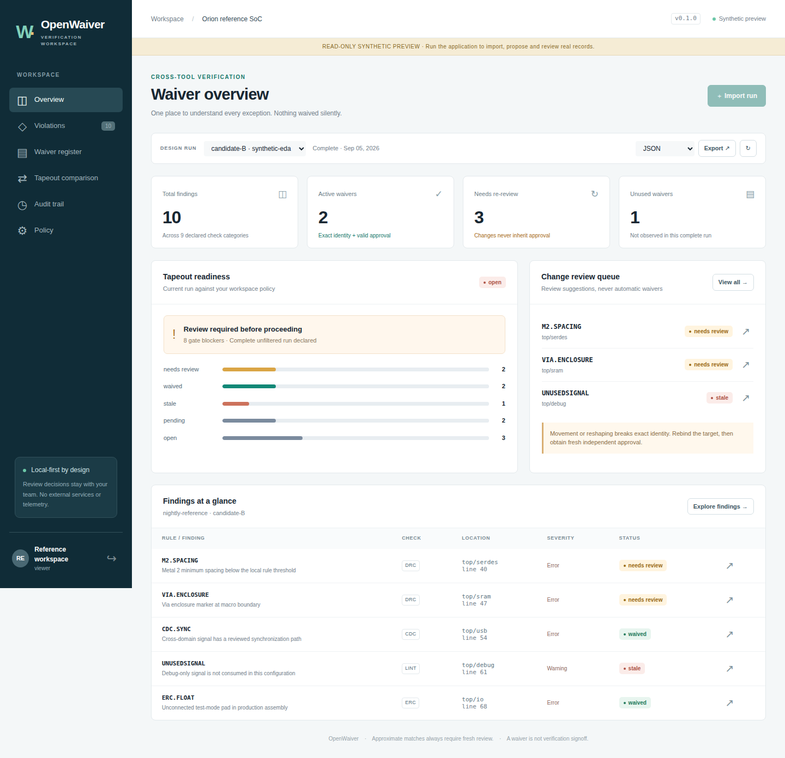

# OpenWaiver

**v0.3 upgrade:** [Physical layout context and federated access-token authentication](docs/V0.3.md).
Native GDS/OASIS extraction retains polygon holes and hierarchy placements. The
[physical review workspace](http://127.0.0.1:8765/physical) visualizes retained evidence;
transform matches never approve waivers. Existing v0.2 records remain readable.


**Cross-tool EDA waiver lifecycle management. Every exception has a reason, an owner, a boundary and a review trail.**

OpenWaiver is a local-first application for DRC, LVS, ERC, lint, CDC, RDC, low-power checks, coverage exclusions and timing exceptions. It combines an authenticated browser workspace, a Python API, a command-line interface, SQLite storage and deterministic Git-friendly YAML exports.

**Version 0.3.0 — early release, not signoff-certified.** This is working software with regression tests, not a promise of superiority over mature commercial verification products. Approximate matches never suppress violations. Only unchanged, uniquely identified findings with currently valid approvals can be waived.



## New in 0.2.0

Project-scoped, expiring/revocable tokens; indexed movement candidates; explicit dependency-graph context; atomic Git-reviewable proposal plans in the browser/API/CLI; offline Ed25519 signatures and ledger checkpoints; independent evidence-bundle replay; and a native-export guard against unapproved same-line suppression.

Local validation: **283 passing tests, 90.76% line coverage**. In one constructed 10,000-finding repeated-rule workload, median pure-engine assessment improved **25.7x versus v0.1**, while recovering all intended review candidates without automatically waiving any changed finding. This is not a commercial benchmark. CI separately tests native Verilator and authenticated browser workflows; inspect the exact commit's checks rather than inferring success from a feature list.

Read [the 0.2 guide, migration details and raw measurements](docs/V0.2.md) and [the evidence-based competitive assessment](docs/COMPETITIVE_EVIDENCE.md).

## Start with synthetic data

Use Python 3.11 or newer. From an extracted source archive or repository checkout:

```bash
python -m venv .venv
source .venv/bin/activate                 # Windows: .venv\Scripts\activate
python -m pip install -e '.[dev]'
python -m pytest
openwaiver demo --serve
```

Open **http://127.0.0.1:8765**. The command prints freshly generated access tokens for `engineer`, `reviewer`, `signoff` and `observer`. Paste the appropriate token into the login screen. Tokens are held in browser memory only. Each demo invocation needs a new workspace directory; it never overwrites an existing database:

```bash
openwaiver demo --workspace another-demo --serve --port 8766
```

The reference chip and every approval/evidence item in this demo are **synthetic**. No foundry data, customer design or proprietary rule deck is included. Screenshots show the application, not an independently verified tapeout.

## What works

| Area | Implemented behavior |
|---|---|
| Report ingestion | Strict documented JSON, CSV, XML and pipe-delimited text; SARIF 2.1.0 subset; Verilator diagnostics; KLayout report-database subset. Unknown or unsupported data fails instead of being silently skipped. |
| Identity | Versioned SHA-256 fingerprints over rule, category, hierarchy, full normalized path, source position, object ID, message, severity, metadata, multiplicity and complete supported geometries. Polygon rotation/reversal normalization preserves shape. |
| Scope isolation | Project + check stream + tool namespaces. Identical text from a different project or tool does not inherit a waiver. |
| Change detection | Source movement, hierarchy movement with explicit object IDs, geometry translation/reshape candidates, changed or missing context, and changed tool/rule-deck/configuration provenance. Candidate scores are explanations, not probabilities or approvals. |
| Governance | Named owners, independent assigned reviewers, evidence, expiration or exact revision bounds, configurable quorum, two-reviewer default for CDC/RDC/timing and critical findings, no self-approval, and content-bound approvals. |
| Review lifecycle | Propose → attach evidence → submit → approve/reject; amend/rebind resets approvals; revoke is terminal. Optimistic versions reject conflicting edits. |
| Completeness | An incomplete run cannot pass. An absent finding marks its waiver unused only when that category was explicitly covered by a complete run. |
| Release gating | Explicit multi-tool manifest, required categories, exact revision, import freshness and optional provenance requirements. Missing or ambiguous streams fail closed. |
| Candidate comparison | Immutable snapshots capture the run, waiver set, policy and assessment. Historical results are not recomputed using today's approvals. |
| Evidence and audit | Content-addressed attachments; transactionally committed SHA-256 event chain; historical waiver revisions; external-head verification; checksummed ZIP bundles with optional HMAC sealing. |
| Interchange | Deterministic per-waiver YAML, JSON/SARIF/JUnit/escaped HTML reports, a narrowly scoped Verilator `.vlt` exporter, and explicitly enabled importer/exporter plug-ins. |
| Interface | Searchable/paginated findings, before/after geometry, waiver review drawers, snapshot comparison, evidence download, audit browser and policy editor. |

## Use a real workspace

Generate different tokens for different people. Save each printed plaintext token securely; the registry stores only hashes. The server reloads expiry, revocation and project grants on each authenticated request; malformed registry edits fail closed.

```bash
openwaiver --db workspace/chip.sqlite3 init
openwaiver auth-create --file workspace/auth.json --name alice --auth-role contributor --project example-chip
openwaiver auth-create --file workspace/auth.json --name bob --auth-role reviewer --project example-chip
openwaiver auth-create --file workspace/auth.json --name carol --auth-role reviewer --project example-chip
openwaiver auth-create --file workspace/auth.json --name admin --auth-role admin --all-projects
openwaiver --db workspace/chip.sqlite3 serve --auth-file workspace/auth.json
```

Use the browser for authenticated human approvals. CLI `--actor` and `--role` are **trusted local attribution**, not authentication against someone who can modify the local files. API tokens can be restricted to exact project names; the examples grant access to `example-chip`. Workspace-wide grants are explicit. Legacy registries without project grants retain workspace-wide access and should be migrated. This is application-level authorization, not separate-database tenant isolation.

Import an **unfiltered** report. `--complete` is an explicit assertion by your trusted collection pipeline, not something the parser can independently prove:

```bash
openwaiver --db workspace/chip.sqlite3 import examples/violations.json \
  --format json --project example-chip --stream rtl-lint --tool verilator \
  --revision candidate-A --complete --checked lint
```

The returned JSON includes a run ID. IDs and versions are also visible in the dashboard. With your actual ID:

```bash
openwaiver --db workspace/chip.sqlite3 gate RUN_ID --format junit --output gate.xml
openwaiver --db workspace/chip.sqlite3 export RUN_ID --format sarif --output assessment.sarif
openwaiver --db workspace/chip.sqlite3 export-yaml review-records
```

Exit codes: **0** passed/success, **1** policy gate blocked, **2** command/input error. `assess` and `export` report findings without using a blocking exit code; use `gate` or `gate-release` in CI. A passing run is **not** a passing entire chip.

For an entire release, edit the explicit checklist in `examples/release-manifest.yaml` and select the required run IDs:

```bash
openwaiver --db workspace/chip.sqlite3 gate-release examples/release-manifest.yaml \
  --output release-gate.json
```

An empty list is invalid. Missing checks, multiple unpinned matching runs, wrong revisions, incomplete coverage, expired import freshness and blocked findings prevent a pass. An omitted requirement is not magically inferred; protect the manifest in code review. Freshness is measured from import time, not independently attested EDA execution time.

## Native-tool integration is deliberately conservative

Verilator controls use rule/file/line scopes, which cannot preserve OpenWaiver's exact occurrence identity, review policy, context or expiration. Consequently native export requires an explicit acknowledgment:

```bash
openwaiver --db workspace/chip.sqlite3 export RUN_ID --format verilator \
  --acknowledge-lossy --output generated.vlt
```

Export is refused if its native rule/file/line scope also contains an unapproved finding. Generate this derivative only after checking an **unfiltered report for the same revision**. Never feed an already filtered report back as proof that all checks ran. Unsafe native identifiers, wildcards and aggregate geometry markers are not silently broadened into waivers.

**Calibre/IC Validator/SpyGlass/Questa proprietary waiver syntax is not implemented or certified.** Use documented neutral exports and add release-specific adapters with official specifications and test fixtures. The generic XML importer does not mean arbitrary vendor XML is supported. Timing exceptions and coverage exclusions are managed as records; this software does not validate their electrical or functional correctness.

## Documentation

- [Input formats and schema examples](docs/FORMATS.md)
- [Architecture, matching and lifecycle semantics](docs/ARCHITECTURE.md)
- [Deployment and trust boundaries](SECURITY.md)
- [Adapter development](docs/PLUGINS.md)
- [Evidence, Git records and release gating](docs/OPERATIONS.md)
- [Commercial comparison boundaries and roadmap](docs/ROADMAP.md)
- [Reproducible local validation](docs/VALIDATION.md)

OpenAPI is available at `/openapi.json`; interactive API documentation at `/docs`. API data endpoints require a bearer token. The documentation UI may load Swagger assets from an external CDN; the main application itself has no external frontend dependency or telemetry.

## Development

```bash
python -m pip install -e '.[dev,browser]'
python -m pytest --cov=openwaiver --cov-report=term-missing
python -m compileall -q src tests scripts
node --check src/openwaiver/static/app.js
node --check src/openwaiver/static/plans.js
playwright install chromium
python scripts/browser_smoke.py
python scripts/benchmark.py --sizes 1000 10000 --output benchmark.json
python scripts/make_preview.py --output OpenWaiver-preview.html
python -m build
```

The browser smoke test checks live authenticated workflows and responsive rendering. Benchmarks are synthetic and measure the pure assessment engine, **not** commercial-tool performance, the full database workflow, or production capacity. See the validation report for exactly what was run on this release.

## License

Apache License 2.0. See [LICENSE](LICENSE). Third-party tools and their formats retain their owners' rights. No endorsement, foundry qualification, safety certification or vendor affiliation is implied.

## Publish your source-only copy to GitHub

The included create-only helper uses your locally authenticated GitHub CLI. It stages a source allowlist in a temporary directory, refuses an existing repository, does not alter global Git configuration, and never copies runtime workspaces. Review the file list before public publication:

```bash
gh auth login --scopes workflow
python scripts/publish_github.py --owner YOUR_GITHUB_LOGIN --dry-run
python scripts/publish_github.py --owner YOUR_GITHUB_LOGIN --public
```

This publishes a **new public** repository named `OpenWaiver`. It does not publish the database or real waiver evidence. The helper does not establish whether a repository has already been published from a particular execution environment; check its success output and the repository visibility.
